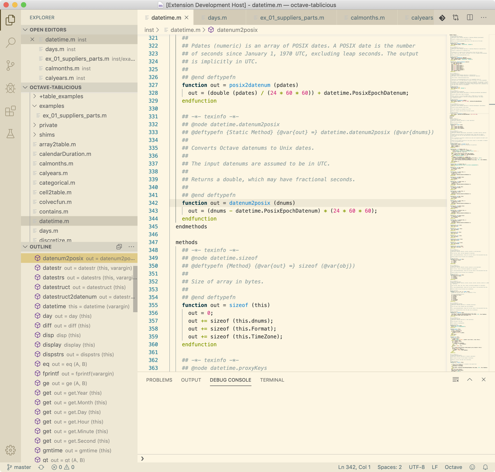

# Octave Hacking

Octave Hacking is an attempt to turn VS Code into a decent IDE for [GNU Octave](https://www.gnu.org/software/octave/).

## Features

* Syntax highlighting
* Outline view and code navigation for functions
* Snippets
  * functions, classdefs, and common control structures

## Debugging

Octave Hacking does not support debugging Octave inside VS Code.
For that, I recommend you install the [Octave Debugger](https://marketplace.visualstudio.com/items?itemName=paulosilva.vsc-octave-debugger) extension by Paulo Silva.

## Example

## Background

[GNU Octave](https://www.gnu.org/software/octave/) is a scientific programming language for numerical analysis that is largely compatible with [MATLAB](https://www.mathworks.com/products/matlab.html). It is free software, cross-platform, and has pervasive support for arrays.

The Octave Hacking extension may be particularly useful to Mac users, because the Octave GUI for newer versions of Octave (5.x and 6.x) does not work correctly on macOS. VS Code with this extension and a debugging extension could be a good substitute.

## Extension Settings

Nothing yet.

## Author

Octave Hacking is written by [Andrew Janke](https://apjanke.net).

The project home page is <https://github.com/apjanke/vscode-octave-hacking>.

Octave Hacking logo produced by [funny.pho.to's Matrix Image Generator](http://funny.pho.to/matrix-image-generator), based on the original [Octave logo](https://www.gnu.org/software/octave/img/octave-logo.svg) by the Octave Developers.

The grammar for syntax highlighting is a lightly customized version of the [TextMate Octave.tmLanguage grammar](https://github.com/textmate/matlab.tmbundle/blob/master/Syntaxes/Octave.tmLanguage).
